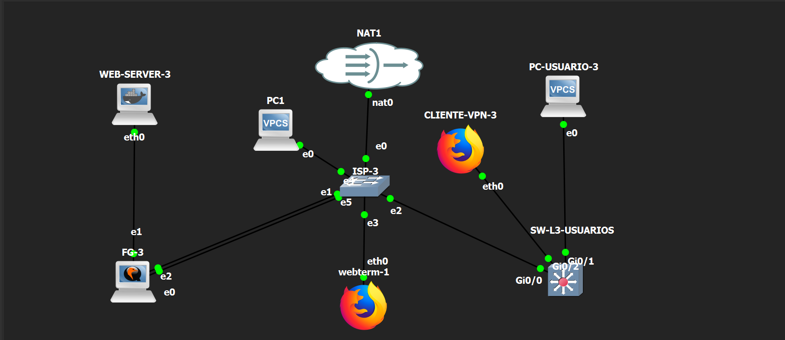

# Infraestructura 3 - Acceso Web Público y SSH mediante VPN

Laboratorio de Seguridad de Redes en GNS3 utilizando FortiGate, un equipo de red y un servidor web para demostrar acceso HTTPS sin VPN y acceso SSH exclusivamente mediante una VPN Remote-Site.

## 🎥 Video demostrativo

[Ver video demostrativo](ENLACE_DEL_VIDEO)

---

## 📌 Objetivo del laboratorio

El objetivo principal de esta infraestructura es aplicar diferentes controles de acceso dependiendo del servicio utilizado.

El usuario debe poder:

- Acceder al servidor web mediante HTTPS sin necesidad de conectarse a una VPN.
- Acceder al mismo servidor mediante SSH únicamente cuando se encuentre conectado a la VPN.

Esto permite separar el acceso público al servicio web del acceso administrativo al servidor.

---

## 🖥️ Topología

La infraestructura está formada por:

- 1 FortiGate
- 1 equipo de red
- 1 servidor web
- 1 equipo de usuario
- 1 segmento ISP
- Red de usuarios mediante VLAN 10
- VPN Remote-Site

### Diagrama de la topología

---

## 🌐 Red de usuarios

La red de usuarios utiliza una máscara `/25`.

Esta red se encuentra dentro de:

`VLAN 10`

Los equipos de usuario reciben su direccionamiento mediante DHCP.

La VLAN 10 permite separar la red de usuarios del resto de los segmentos de la infraestructura.

---

## 🖥️ Servidor WEB

El servidor se encuentra en una red con máscara:

`/28`

El servidor ofrece los siguientes servicios:

- HTTPS
- SSH

El servicio HTTPS puede ser accedido sin necesidad de utilizar una VPN.

El acceso SSH, en cambio, debe realizarse únicamente mediante la VPN configurada.

---

## 🔐 Acceso HTTPS sin VPN

Uno de los objetivos principales de la práctica es permitir que un usuario pueda acceder al servidor web directamente mediante HTTPS.

El usuario no necesita establecer previamente una conexión VPN para utilizar este servicio.

Esta configuración permite publicar únicamente el servicio web necesario sin exponer directamente los servicios administrativos del servidor.

---

## 🔑 Acceso SSH mediante VPN

El acceso SSH al servidor se encuentra restringido.

Para poder conectarse mediante SSH, el usuario debe establecer primero una conexión mediante la VPN Remote-Site configurada en FortiGate.

Una vez establecida la VPN, el cliente puede alcanzar la dirección privada del servidor y realizar la conexión SSH.

Sin la VPN, el acceso SSH al servidor debe permanecer bloqueado.

---

## 🔒 VPN Remote-Site

FortiGate se utiliza para establecer una VPN Remote-Site entre el cliente y la infraestructura protegida.

Esta VPN permite que el usuario remoto pueda acceder de forma segura a los recursos internos autorizados.

La VPN se utiliza específicamente para proteger el acceso administrativo mediante SSH.

---

## 🛡️ FortiGate

FortiGate es el dispositivo encargado de controlar la comunicación entre las diferentes redes.

Entre sus funciones dentro de esta infraestructura se encuentran:

- Configuración de interfaces de red
- Control de acceso mediante políticas de firewall
- Publicación del servicio HTTPS
- Restricción del acceso SSH
- Configuración de la VPN Remote-Site
- Enrutamiento entre las diferentes redes

Toda la configuración y demostración de FortiGate se realiza mediante su interfaz gráfica.

---

## 🔀 Equipo de red

Se utiliza un equipo de red para conectar la red de usuarios con el resto de la infraestructura.

Este dispositivo se encarga de:

- Configuración de VLAN 10
- Conectividad de los usuarios
- Comunicación con FortiGate
- Transporte del tráfico entre las redes correspondientes

---

## 🌍 ISP

El segmento ISP representa la red externa utilizada para comunicar al usuario con la infraestructura.

En este segmento se utilizan direcciones IP públicas para representar un escenario de acceso externo.

---

## 📡 DHCP

Los usuarios conectados a VLAN 10 reciben su configuración IP mediante DHCP.

Esto permite asignar automáticamente:

- Dirección IP
- Máscara de red
- Gateway

---

## 🧭 Traceroute

Como parte de las pruebas de conectividad se realiza un `traceroute` desde el usuario hacia el servidor.

Esta prueba permite observar el recorrido seguido por el tráfico hasta alcanzar el destino.

---

## ✅ Pruebas realizadas

Para comprobar el funcionamiento de la infraestructura se realizan las siguientes pruebas:

### HTTPS sin VPN

Se verifica que el usuario pueda acceder al servidor web mediante HTTPS sin establecer previamente una VPN.

### SSH sin VPN

Se intenta acceder al servidor mediante SSH sin utilizar la VPN.

El acceso debe fallar.

### SSH con VPN

Se establece la VPN Remote-Site.

Después de conectarse a la VPN se realiza nuevamente la prueba SSH.

El acceso debe funcionar correctamente.

### DHCP

Se comprueba que el usuario reciba automáticamente una dirección IP dentro de la red correspondiente a VLAN 10.

### Traceroute

Se realiza un traceroute desde el usuario hacia el servidor para observar el recorrido del tráfico.

---

## 📸 Evidencias

Las capturas de la configuración y de las pruebas se encuentran almacenadas en:

`imagenes/`

Entre las evidencias se incluyen:

- Topología completa
- VLAN 10
- DHCP
- Interfaces de FortiGate
- Configuración de la VPN
- Estado de la VPN
- Acceso HTTPS sin VPN
- Intento de SSH sin VPN
- SSH funcionando mediante VPN
- Traceroute hacia el servidor

---

## ⚙️ Running Configurations

En el repositorio se incluyen las configuraciones de los dispositivos utilizados.

### FortiGate

`fortigate.conf`

### Equipo de red

`switch-cisco.txt`

Estos archivos permiten revisar de forma más detallada la configuración utilizada durante la práctica.

---

## 📂 Scripts y comandos

Los comandos utilizados durante las pruebas y verificaciones se almacenan en:

`scripts/comandos-utilizados.txt`

---

## 📝 Conclusión

Durante esta práctica se implementó una infraestructura donde diferentes servicios tienen distintos niveles de acceso.

El servicio HTTPS puede ser utilizado directamente sin necesidad de VPN, mientras que el acceso administrativo mediante SSH requiere una conexión VPN Remote-Site.

De esta manera se reduce la exposición directa del servicio SSH y se permite que únicamente los usuarios conectados mediante VPN puedan realizar tareas administrativas sobre el servidor.

También se comprobó la asignación de direcciones mediante DHCP y el recorrido del tráfico mediante traceroute.
